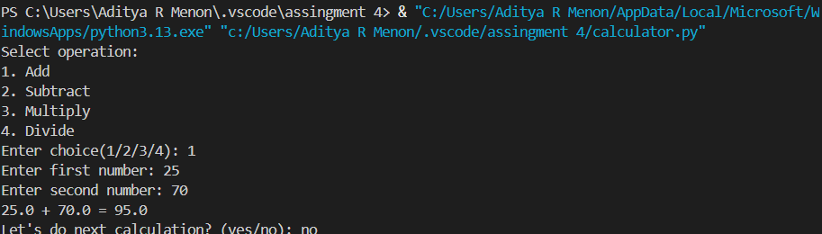

# Python Calculator

## Project Description
A console-based calculator developed in Python that performs addition, subtraction, multiplication, and division.

## Installation and Usage
1. Clone the repository.
2. Run the command: `python calculator.py`
3. Follow the on-screen prompts to enter numbers.

## Features
- Basic Arithmetic Operations
- Error handling for division by zero
- Loop feature for continuous calculations

## Screenshots

